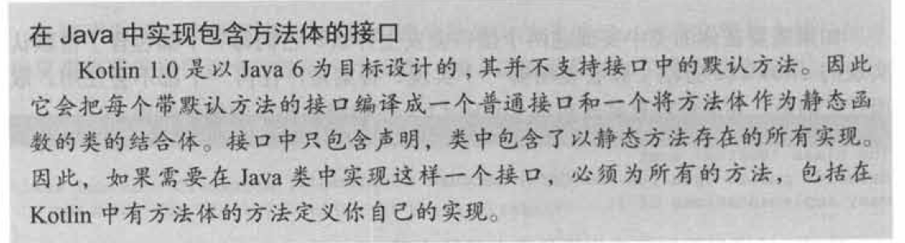
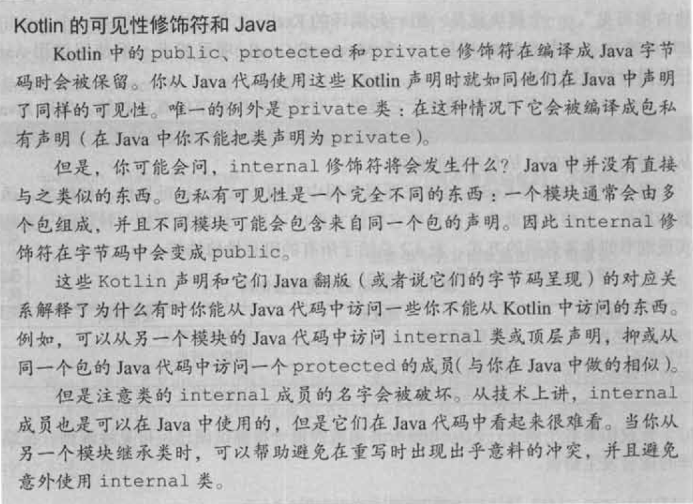
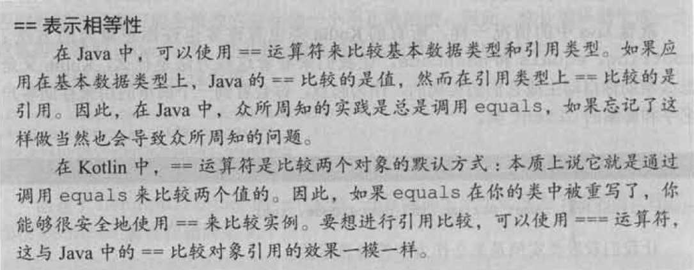
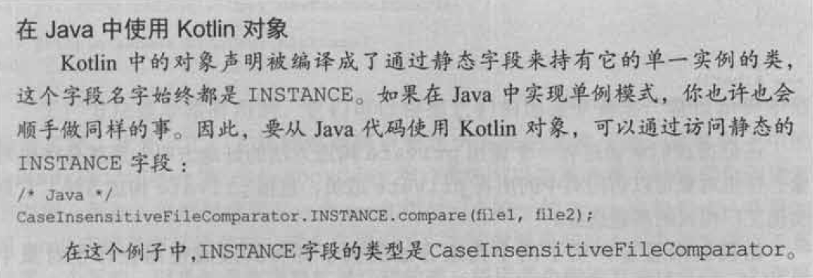
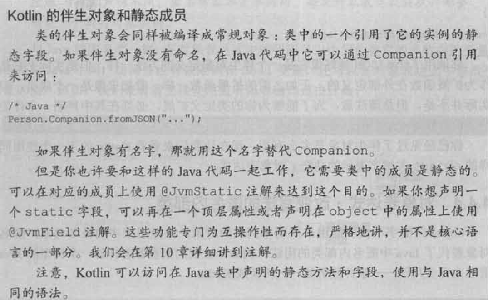

# 类、对象和接口

## 定义类的继承结构

#### 接口

* kotlin的接口与java 8中的相似: 可以包含抽象方法的定义以及非抽象方法的实现(与java 8中的默认方法类似)，但不能包含任何状态。
```
interface Clickable {
    fun click()
}
class Button : Clickable {
    override fun click() = println("I was clicked")
}
```
* kotlin在类名后面使用冒号来代替java中的extends和implements关键字。
* 和java一样，一个类可以实现任意多个接口，但是只能继承一个类。
* 和java中的@Override注解类似，override修饰符用来标注被重写的父类或接口的方法和属性。与java不同的是，在kotlin中使用override修饰符是强制要求的。
* 接口的方法可以有一个默认实现。与java 8不同的是，java 8中需要在实现上标注default关键字，而kotlin没有特殊的注解，只需要提供一个方法体。
```
// 在接口中定义一个带方法体的方法(默认实现)
interface Clickable {
    fun click()
    fun showOff() = println("I'm clickable!")
}
```
* 两个接口默认实现了相同的方法。如果一个类实现了这两个接口，任何一个默认实现都不会使用，需要显式地实现showOff方法，否则编译器会报错。
```
interface Focusable {
    fun setFocus(b: Boolean) = println("I ${if (b) "got" else "lost"} focus.")
    fun showOff() = println("I'm focusable!")
}
class Button : Clickable, Focusable {
    override fun click() = println("I was clicked")
}
```
```
class Button : Clickable, Focusable {
    override fun click() = println("I was clicked")
    override fun showOff() {
        // 使用尖括号加上父类型名字的super表明调用哪个父类的方法
        // 在java中可以把基类的名字放在super关键字前面，如: Clickable.super.showOff()
        super<Clickable>.showOff()
        super<Focusable>.showOff()
    }
}
```
* 如果只需要调用一个继承的实现，可以这样写:
```
override fun showOff() = super<Clickable>.showOff()
```


#### open、final和abstract修饰符

* java的类和方法默认是open的，而kotlin中默认都是final的。
* 如果需要创建一个类的子类，需要使用open修饰符来标示这个类。此外，需要给每一个可以被重写的属性或方法添加open修饰符。
```
// 声明一个带一个open方法的open类
open class RichButton : Clickable { // 这个类是open的，其它类可以继承它
    fun disable() {} // 这个函数是final的，不能在子类中重写它
    open fun animate() {} // 这个函数是open的，可以在子类中重写它
    override fun click() {} // 这个函数重写了一个open函数并且它本身同样是open的
}
```
* 重写一个基类或者接口的成员，重写了的成员同样默认是open的。如果想阻止当前类的子类重写方法，可以显式指定成员标注为final。
```
open class RichButton : Clickable {
    // 在这里final并没有被删减，是因为没有final的override意味着是open的
    final override fun click() {}
}
```
* 在kotlin中，同java一样，可以将一个类声明为abstract，这种类不能被实例化。一个抽象类通常包含一些没有实现并且必须在子类重写的抽象成员。抽象成员始终是open的，所以不需要显式地使用open修饰符。
```
abstract class Animated {
    // 抽象函数，没有实现，必须被子类重写
    abstract fun animate()
    // 非抽象函数并不是默认open的，但是可以标注为open的
    open fun stopAnimating() {
        ....
    }
    fun animateTwice() {
        ....
    }
}
```
* 类中访问修饰符的意义。在接口中，不能使用final、open或者abstract。接口中的成员始终是open的，不能将其声明为final的。如果它没有函数体，那就是abstract的，但是这个关键字并不是必需的。

| 修饰符 | 相关成员 | 评注 |
|--------|----------|------|
| final  | 不能被重写 | 类中成员默认使用 |
| open   | 可以被重写 | 需要明确地表明 |
| abstract | 必须被重写 | 只能在抽象类中使用，抽象成员不能有实现 |
| override | 重写父类或接口中的成员 | 如果没有使用final表明，重写的成员默认是open的 |


#### 可见性修饰符

* kotlin中使用public、protected和private修饰符，默认可见性(省略了修饰符)为public。
* java中默认可见性为包私有，kotlin只把包作为在命名空间里组织代码的一种方式。
* kotlin提供了一个新的修饰符，internal，表示"只在模块内部可见"。一个模块就是一组一起编译的kotlin文件。
* internal可见性的优势在于提供了对模块实现细节的真正封装。使用java时，这种封装很容易被破坏，因为外部代码可以将类定义到与你代码相同的包中，从而得到访问你的包私有声明的权限。
* kotlin允许在顶层声明中使用private可见性，包括类、函数和属性。
* kotlin的可见性修饰符

| 修饰符 | 类成员 | 顶层声明 |
|--------|--------|----------|
| public(默认) | 所有地方可见 | 所有地方可见 |
| internal | 模块中可见 | 模块中可见 |
| protected | 子类中可见 | - |
| private | 类中可见 | 文件中可见 |

* 错误实例
```
internal open class TalkativeButton : Focusable {
    private fun yell() = println("Hey!")
    protected fun whisper() = println("Let's talk!")
}
// 错误: "public"成员暴露了其"internal"接收者类型TalkativeButton
fun TalkativeButton.giveSpeech() { 
    yell() // 错误: 它是private方法。
    whisper() // 错误: 它是protected方法。
}
```
* 一个通用规则: 类的基础类型和类型参数列表中用到的所有类，或者函数的签名都有与这个类或者函数本身相同的可见性。
* protected修饰符在java和kotlin中行为不同。在java中，可以从同一个包中访问一个protected成员，但kotlin不允许。在kotlin中可见性规则非常简单，protected成员只在类和它的子类中可见。类的扩展函数不能访问它的private和protected成员。


#### 内部类和嵌套类

* 像java一样，在kotlin中可以在另一个类中声明一个类。区别是kotlin的嵌套类不能访问外部类的实例。
```
interface State : Serializable
interface View {
    fun getCurrentState() : State
    fun restoreState(state: State) {}
}
public class Button implements View {
    @Override
    public State getCurrentState() {
        return new ButtonState();
    }
    @Override
    public void restoreState(State state) {
        ...
    }
    public class ButtonState implements State {
        ....
    }
}
// 以上代码会抛出异常java.io.NotSerializableException，因为内部类中隐式地存储了外部Button类的引用，而Button不可序列化。
```
```
// 在kotlin中使用嵌套类来实现View
class Button : View {
    override fun getCurrentState() : State = ButtonState()
    override fun restoreState(State state) {
        ...
    }
    class ButtonState : State {
        ....
    }
}
```
* kotlin中没有显式修饰符的嵌套类与java中的static嵌套类是一样的。要把它变成一个内部类来持有一个外部类的引用的话，需要使用inner修饰符。

| 类A在另一个类B中声明 | java | kotlin |
|----------------------|------|--------|
| 嵌套类(不存储外部类的引用) | static class A | class A |
| 内部类(存储外部类的引用) | class A | inner class A |

* 在kotlin中引用外部类实例的语法也与java不同。需要使用this@Outer从Inner类去访问Outer类。
```
class Outer {
    inner class Inner {
        fun getOuterReference() : Outer = this@Outer
    }
}
```

#### 密封类

* 作为接口实现的表达式。如果你添加了一个新的子类，编译器并不能发现有地方改变了。如果你忘记了添加一个新分支， 就会选择默认的选项，这有可能导致潜在的bug。
```
interface Expr
class Num(val value: Int) : Expr
class Sum(val left: Expr, val right: Expr) : Expr
fun eval(e: Expr) : Int = 
    when (e) {
        is Num -> e.value
        is Sum -> eval(e.right) + eval(e.left)
        else -> throw IllegalArgumentException("Unknown expression")
    }
```
* 作为密封类的表达式。sealed修饰符隐含的这个类是一个open 类，你不再需要显式地添加open修饰符。当你在when中使用sealed 类并且添加一个新的子类的时候，有返回值的when表达式会导致编译失败，它会告诉你哪里的代码必须要修改。在这种情况下，Expr类有一个只能在类内部调用的private构造方法。
```
sealed class Expr { // 将基类标记为密封的
    // 将所有可能的类作为嵌套类列出
    class Num(val value: Int) : Expr()
    class Sum(val left: Expr, val right: Expr) : Expr()
}
fun eval(e: Expr) : Int = 
    when (e) {
        is Expr.Num -> e.value
        is Expr.Sum -> eval(e.right) + eval(e.left)
    }
```

## 声明类

#### 初始化类

* 主构造方法和初始化语句块
```
class User(val nickname: String)
等价于
class User constructor(_nickname: String) { // 带一个参数的主构造方法
    val nickname: String
    init { // 初始化语句块
        nickname = _nickname
    }
}
```
* constructor关键字用来开始一个主构造方法或从构造方法的声明。init关键字用来引入一个初始化语句块，包好了在类被创建时执行的代码，并会与主构造方法一起使用。可以在一个类中声明多个初始化语句块。如果主构造方法没有注解或可见性修饰符，同样可以去掉constructor关键字。如果属性用相应的构造方法参数来初始化，代码可以通过把val关键宇加在参数前的方式来进行简化。
```
class User(_nickname: String) {
    val nickname = _nickname
}
// 简写
class User(val nickname: String)
```
* 可以像函数一样为构造方法参数声明一个默认值。
```
class User(val nickname: String, val isSubscribed: Boolean = true)
```
* 要创建一个类实例，只需要直接调用构造方法，不需要new关键字。
* 如果所有的构造方法参数都有默认值，编译器会生成一个额外的不带参数的构造方法来使用所有的默认值，可以通过无参构造方法来实例化类。
* 一个类具有父类，则主构造方法同样需要初始化父类。
```
open class User(val nickname: String) { ... }
class TwitterUser(nickname: String) : User(nickname) { ... }
```
* 如果没有给一个类声明任何的构造方法，将会生成一个不带任何参数的默认构造方法。
```
open class Button
```
* 如果继承了Button类并且没有提供任何的构造方法，必须显式地调用父类构造方法，即使它没有任何参数。这就是为什么在父类名称后面还有一个空的括号。注意与接口的区别: 接口没有构造方法，所有在实现一个接口时，不需要在父类型列表中它的名称后面再加上括号。
```
class RadioButton : Button()
```
* 如果想要确保你的类不被其他代码实例化，必须把构造方法标记为private。
```
class Secretive private constructor() {}
```

#### 构造方法

* 通常来讲，使用多个构造方法的类在Kotlin代码中不如在Java中常见。大多数在Java中需要重载构造方法的场景都被Kotlin支持参数默认值和参数命名的语法涵盖了。不要声明多个从构造方法用来重载和提供参数的默认值。取而代之的是，应该直接标明默认值。
* kotlin中多个从构造方法。
```
open class View { // 没有声明主构造方法
    constructor(ctx: Context) { // 从构造方法
        ....
    }
    constructor(ctx: Context, attr: AttributeSet) { // 从构造方法
        ....
    }
}
```
* 继承的类，可以声明同样的构造方法。
```
class MyButton : View {
    constructor(ctx: Context) : super(ctx) { // 调用父类构造方法
        ...    
    }
    constructor(ctx: Context, attr: AttributeSet) : super(ctx, attr) { // 调用父类构造方法
        ...
    }
}
```
* 可以使用this()关键字，从一个构造方法中调用类的另一个构造方法。
```
class MyButton : View {
    constructor(ctx: Context): this(ctx, MY_STYLE) { // 委托给这个类的另一个构造方法
        ...
    }
    constructor(ctx: Context, attr: AttributeSet): super(ctx, attr) {
        ...
    }
}
```
* 如果类没有主构造方法，那么每个从构造方法必须初始化基类或委托给另一个构造方法。

#### 实现在接口中声明的属性

* 在kotlin中，接口可以包含抽象属性声明。
```
interface User {
    val nickname: String
}
```
* 接口本身并不包含任何状态，因此只有实现这个接口的类在需要的情况下会存储这个值。
```
class PrivateUser(override val nickname: String) : User // 主构造方法属性
class SubscrbingUser(val email: String) : User {
    override val nickname: String
        get() = email.substringBefore('@') // 自定义getter
}
class FacebookUser(val accountId: Int) : User {
    override val nickname = getFacebookName(accountId) // 属性初始化
}
// 请注意nickname在SubscribingUser和FacebookUser中的不同实现。即使它们看起来很相似，第一个属性有一个自定义getter在每次访问时计算substringBefore，然而FacebookUser中的属性有一个支持字段来存储在类初始化时计算得到的数据。
```
* 除了抽象属性声明外，接口还可以包含具有getter和setter 的属性，只要它们没有引用一个支持字段(支持宇段需要在接口中存储状态，而这是不允许的)。
```
interface User {
    val email: String
    val nickname: String
        get() = email.substringBefore('@') // 属性没有支持字段，每次访问时通过计算得到
}
```

#### 通过getter或setter访问支持字段

* 定义属性的两种方式: 存储值的属性和具有自定义访问器在每次访问时计算值的属性。
* 在setter的函数体中，使用了特殊的标识符field来访问支持字段的值。在getter中，只能读取值；而在setter中，既能读取它也能修改它。
```
class User(val name: String) {
    var addrss: String = "unspecified"
        set(value: String) {
            println(""" Addrss was changed for $name: "$field" -> "$value". """).trimIndent())
            field = value
        }
}
```

#### 修改访问器的可见性

* 访问器的可见性默认与属性的可见性相同。可以通过在get和set关键字前放置可见性修饰符的方式来修改。
```
class LengthCounter {
    var counter: Int = 0
        private set // 不能在类外修改这个属性
    fun addWord(word: String) {
        counter += word.length
    }
}
```

## 编译器生成的方法

#### 通用对象方法

* 就像Java中的情况一样，所有的Kotlin类也有许多也许你想重写的方法: toString、equals和hashCode。
```
class Client(val name: String, val postalCode: Int)
val client1 = Client("Alice", 123456)
println(client1) // 默认打印一个对象字符串表示形如Client@5e9f23b4
```
* toString()方法
```
class Client(val name: String, val postalCode: Int) {
    override fun toString() = "Client(name=$name, postalCode=$postalCode)"
}
val client1 = Client("Alice", 123456)
println(client1) // 打印出Client(name=Alice, posta1Code=123456)
```
* equal()方法。
```
val client1 = Client("Alice", 123)
val client2 = Client("Alice", 123)
println(client1 == client2) // false
```

```
class Client(val name: String, val postalCode: Int) {
    // Any是java.lang.Object的模拟: kotlin中所有类的父类。
    // 可空类型"Any?"意味着"other"是可以为空的
    override fun equals(other: Any?): Boolean {
        if (other == null || other !is Client)
            return false
        return name == other.name && postalCode == other.postalCode    
    }
    override fun toString() = "Client(name=$name, postalCode=$postalCode)"
}
// kotlin中的is检查是java中instanceof的模拟，用来检查一个值是否为一个指定的类型。!is运算符是is的逆运算。
// kotlin中override修饰符是强制的，如果没有，会添加一个新的方法而不是重写。
```
* hasCode()方法，通常与equals一起被重写。如果两个对象相等，则必须有相同的hash值。
```
class Client(val name: String, val postalCode: Int) {
    ...
    override fun hasCode(): Int = name.hasCode() * 31 + postalCode
}
val processed = hashSetOf(Client("Alice", 123))
println(processed.contains(Client("Alice", 123))) // true
```
* copy()方法。一个允许copy类的实例的方法，并在copy的同时修改某些属性的值。副本有着单独的生命周期而且不会影响代码中引用原始实例的位置。
```
class Client(val name: String, val postalCode: Int) {
    ...
    fun copy(name: String = this.name, postalCode: Int = this.postalCode) = 
        Client(name, postalCode)
}
```

#### 类委托

* 装饰器模式: 这种模式的本质就是创建一个新类，实现与原始类一样的接口，并将原来的类的实例作为一个字段保存，与原始类拥有同样行为的方法不用被修改，只需要直接转发到原始类的实例。
```
class DelegatingCollection<T> : Collection<T> {
    private val innerList = arrayListOf<T>()
    override val size : Int get() = innerList.size
    override fun isEmpty(): Boolean = innerList.isEmpty()
    override fun contains(element: T): Boolean = innerList.contains(element)
    override fun iterator() : Iterator <T> = innerList.iterator()
    override fun containsAll(elements: Collection<T>): Boolean = innerList.containsAll(elements)
}
```
* kotlin引入委托。无论什么时候实现一个接口，都可以使用by关键字将接口的实现委托到另一个对象。
```
class DelegatingCollection<T>(
    innerList: Collection<T> = ArrayList<T>()
) : Collection<T> by innerList {}
```
```
class CountingSet<T>(
    val innerSet: MutableCollection<T> = HashSet <T>()
) : MutableCollection<T> by innerSet ( // 将MutableCollection的实现委托给innerSet
    var objectsAdded = O
    override fun add(element: T ) : Boolean {
        objectsAdded++
        return innerSet.add(element)
    }
    override fun addAll(c: Collection<T>): Boolean {
        objectsAdded += c.size
        return innerSet.addAll(c)
    }
}
```

## object关键字

#### 对象声明

* 在java中，通常可以使用单例模式来实现，定义一个使用private构造方法并且用静态字段来持有这个类仅有的实例。
* kotlin通过使用对象声明功能，将类声明与该类的单一实例声明结合到一起。
```
object Payroll {
    val allEmployees = arrayListOf<Person>()
    fun calculateSalary() {
        for (person in allEmployees) {
            ...
        }
    }
}
```
* 对象声明通过object关键字引入。一个对象声明可以非常高效地以一句话来定义一个类和一个该类的变量。
* 与类一样，一个对象声明也可以包含属性、方法、初始化语句块等的声明。唯一不允许的就是构造方法(包括主构造方法和从构造方法)。与普通类的实例不同，对象声明在定义的时候就立即创建了，不需要在代码的其他地方调用构造方法。
* 与变量一样，对象声明允许使用对象名加.字符的方式来调用方法和访问属性。
```
Payroll.allEmployees.add(Person(...))
Payroll.calculateSalary()
```
* 对象声明同样可以继承类和接口。
```
object CaseInsensitiveFileComparator : Comparator<File> {
    override fun compare(file1: File, file2: File): Int {
        return file1.path.compareTo(file2.path, ignoreCase = true)
    }
}
println(CaseInsensitiveFileComparator.compare(File("/User"), File("/user"))) // 0
```
* 可以在任何可以使用普通对象的地方使用单例对象。
```
val files = listOf(File("/Z"), File("/a"))
println(files.sortedWith(CaseInsensitiveFileComparator)) // [/a, /z]
```
* 同样可以在类中声明对象，它们在每个容器类的实例中并不具有不同的实例。
```
data class Person(val name: String) {
    object NameComparator: Comparator<Person> {
        override fun compare(p1: Person, p2: Person): Int = 
            p1.name.compareTo(p2.name)
    }
}
val persons = listOf(Person("Bob"), Person("Alice"))
println(persons.sortedWith(Person.NameComparator))
```


#### 伴生对象

* kotlin中的类不能拥有静态成员，java的static关键字并不是kotlin语音的一部分。作为替代，kotlin依赖包级别函数(在大多数情形下能够替代java的静态方法)和对象声明(在其他情况下替代java的静态方法，同时还包括静态字段)。在大多数情况下，还是推荐使用顶层函数。但是顶层函数不能访问类的private成员。因此，如果需要写一个可以在没有类实例的情况下调用，但是需要访问类内部的函数，可以将其写成那个类中的对象声明的成员。
* 使用companion来定义伴生对象，这样就可以直接通过容器类名称来访问这个对象的方法和属性的能力，不再需要显式地指明对象的名称，最终的语法看起来非常像java中的静态方法调用。
```
class A {
    companion object {
        fun bar() {
            println("Companion object called")
        }
    }
}
A.bar()
```
* 伴生对象可以访问类中的所有private成员，包括private构造方法，它是实现工厂模式的理想选择。
```
// 定义一个拥有多个从构造方法的类
class User {
    val nickname: String
    constructor(email: String) {
        nickname = email.substringBefore('@')
    }
    constrctor(facebookAccountId: Int) {
        nickname = getFacebookName(facebookAccountId)
    }
}
```
```
// 使用工厂方法来替代从构造方法
class User private constructor(val nickname: String) { // 将主构造方法标记为私有
    companion object { // 伴生对象
        // 用工厂方法创建新用户
        fun newSubscibingUser(email: String) = 
            User(email.substringBefore('@'))
        fun newFaceUser(accountId: Int) =
            User(getFacebookName(accountId))
    }
}
val subscribingUser = User.newSubscribingUser("bob@gmail.com")
val facebookUser = User.newFacebookUser(4)
```
* 伴生对象成员在子类中不能被重写。


#### 作为普通对象使用的伴生对象

* 伴生对象是一个声明在类中的普通对象，可以有名字，实现一个接口或者有扩展函数或属性。
```
class Person(val name: String) {
    companion object Loader {
        fun fromJSON(jsonText: String): Person = ...
    }
}
// 可以通过两种方式来调用fromJSON
person = Person.Loader.fromJSON("{name: 'ABC'}")
person2 = Person.fromJSON("{name: "BCD"}")
```
* 在伴生对象中实现接口
```
interface JSONFactory<T> {
    fun fromJSON(jsonText: String): T
}
class Person(val name: String) {
    companion object : JSONFactory<Person> {
        override fun fromJSON(jsonText: String) : Person = ... // 实现接口的伴生对象
    }
}
fun loadFromJSON<T>(factory: JSONFactory<T>): T {
    ....
}
loadFromJSON(Person) // 将伴生对象实例传入函数中
```

* 伴生对象扩展。扩展函数允许你定义可以通过代码库中其它地方的类实例调用的方法。但是如果你需要定义可以通过类自身调用的方法，就像伴生对象方法或者是java静态方法该如何？如果类有一个伴生对象，可以通过在其上定义扩展函数来实现。
```
class Person(val firstName: String, val lastName: String) {
    companion object { // 声明一个空的伴生对象
    }
}
// 声明一个扩展函数
fun Person.Companion.fromJSON(json: String): Person {
    ...
}
val p = Person.fromJSON(json)
```

#### 对象表达式

* object关键字不仅能用来声明单例式的对象，还能用来声明匿名对象。匿名对象替代了java中匿名内部类的用法。
```
window.addMouseListener(object : MouseAdapter() {
    override fun mouseClicked(e: MouseEvent) {
        ...
    }
    override fun mouseEntered(e: MouseEvent) {
        ...
    }
})
```
* 对象表达式声明了一个类并创建了该类的一个实例，但是并没有给这个类或实例分配一个名字。
* 如果需要给对象分配一个名字，可以将其存储到一个变量中。
```
val listener = object : MouseAdapter() {
    override fun mouseClicked(e: MouseEvent) { ... }
    override fun mouseEntered(e: MouseEvent) { ... }
}
```
* 与java匿名内部类只扩展一个类或实现一个接口不同，kotlin的匿名对象可以实现多个接口或者不实现接口。
* 与对象声明不同，匿名对象不是单例的。每次对象表达式被执行都会创建一个新的对象实例。
* 从匿名对象访问局部变量，在java中变量需要被限制成final。
```
fun countClicks(window: Window) {
    var clickCount = 0 // 声明局部变量
    window.addMouseListener(object : MouseAdapter() {
        override fun mouseClicked(e: MouseEvent) { 
            clickCount++ // 更新变量的值
        }
    })
}
```


