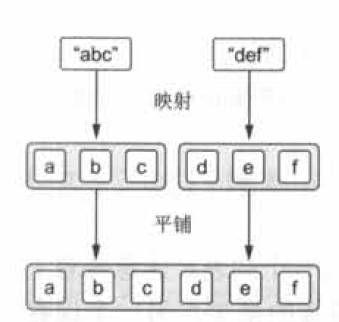

# Lambda编程

## Lambda表达式和成员引用

* kotlin的lambda表达式始终用花括号包围，实参并没有用括号括起来，箭头把实参列表和lambda的函数体隔开。
```
{ x: Int, y: Int -> x + y }
  参数              函数体
```
* 可以把lambda表达式存储在一个变量中，把这个变量当作函数对待。
```
val sum = { x: Int, y: Int -> x + y }
println(sum(1, 2))
```
* 直接调用lambda表达式。这样的语法没有什么意义，如果确实需要把一小段代码封闭在一个代码块中，可以使用库函数run来执行传给它的lambda
```
{ println(42) }()
等价于
run { println(42) }
```

#### 简写的演变

```
val people = listOf(Person("Alice", 29), Person("Bob", 31))
println(people.maxBy { it.age })
// 如果不用任何简明语法来重写这个例子
people.maxBy({ p: Person -> p.age }) // 花括号中的代码为lambda表达式，作为实参传给函数
// kotlin约定，如果lambda表达式是函数调用的最后一个实参，它可以放到括号的外边。
people.maxBy() { p: Person -> p.age }
// 当lambda是函数唯一的实参时，还可以去掉调用代码中的空括号对
people.maxBy { p: Person -> p.age }
// 当你有多个实参时，既可以把lambda留在括号内来强调它是一个是实参，也可以把它放在括号的外面，两种选择都是可
行的。如果你想传递两个或更多的lambda，不能把超过一个的lambda放到外面。这时使用常规语法来传递它们通常是更好的选择。
```
* 把lambda作为命名实参传递
```
val people = listOf(Person("Alice", 29), Person("Bob", 31))
val names = people.joinToString(separator = " ", transform = { p: Person -> p.name })
```
* 把lambda放在括号外传递
```
people.joinToString(" ") { p: Person -> p.name }
```
* 省略lambda参数类型。如果参数类型可以被推导出来，就不需要显式地指定。
```
people.maxBy { p: Person -> p.age }
people.maxBy { p -> p.age }
```
* 使用默认参数名称it代替命名参数。如果当前上下文期望的是只有一个参数的lambda且这个参数的类型可以推断出来，就会生成这个名称。it约定能大大缩短代码，但不能滥用，尤其是在嵌套lambda的情况下，最好显式地声明每个lambda的参数。
```
people.maxBy { it.age }
```
* 使用变量存储lambda，必须显式地指定参数类型。
```
val getAge = { p: Person -> p.age }
people.maxBy(getAge)
```
* lambda表达式可以包含更多的语句，最后一个表达式就是lambda的结果
```
val sum = { x: Int, y: Int ->
    println("Computing the sum of $x adn $y...")
    x + y
}
println(sum(1, 2))
```

#### 在作用域中访问变量

* 当在函数内声明一个匿名内部类时，能够在这个匿名类内部引用这个函数的参数和局部变量。同样在函数内部使用lambda，也可以访问这个函数的参数，还有在lambda之前定义的局部变量。
* 在lambda中使用函数参数。
```
fun printMessagesWithPrefix(message: Collection<String>, prefix: String) {
    messages.forEach { // 接收lambda作为实参，指定对每个元素的操作
        println("$prefix $it") // 在lambda中访问局部变量prefix
    }
}
```
* kotlin和java的一个显著区别是，在kotlin中不会仅限于访问final变量，在lambda内部也可以修改这些变量。
```
fun printProblemCounts(responses: Collection<String>) {
    var clientErrors = 0
    var serverErrors = 0
    responses.forEach {
        if (it.startsWith("4")) {
            clientErrors++
        } else if (it.startsWith("5")) {
            serverErrors++
        }
    }
    println("$clientErrors client errors, $serverErrors server errors")
}
```
* 注意，默认情况下，局部变量的生命期被限制在声明这个变量的函数中。但是如果它被lambda捕捉了，使用这个变量的代码可以被存储并稍后再执行。当你捕捉final变量是，它的值和使用这个值的lambda代码一起存储。而对非final变量来说，它的值被封装在一个特殊的包装器中，这样就可以改变这个值，而对这个包装器的引用会和lambda代码一起存储。


#### 成员引用

* 在lambda中可以把代码块作为参数传递给函数。
* kotlin和java 8一样，如果把函数转换成一个值，就可以当作参数传递它，使用::运算符来转换。
```
val getAge = Person::age
等价于
val getAge = { person: Person -> person.age }
```
* 成员引用，提供了简明语法，来创建一个调用单个方法或者访问单个属性的函数值。
* 不管你引用的是函数还是属性，都不要在成员引用的名称后面加括号。
* 成员引用和调用该函数的lambda具有一样的类型，所以可以互换使用。
```
people.maxBy(Person::age)
```
* 还可以引用顶层函数(不是类的成员)，省略了类名称，直接以::开头。
```
fun salute() = println("Salute!")
run(::salute)
```
* 如果lambda要委托给一个接收多个参数的函数，提供成员引用替代它将会非常方便。
```
val action = { person: Person, message: String ->
    sendEmail(person, message)
}
等价于
val nextAction = ::sendEmail
```
* 可以用构造方法引用存储或者延期执行创建类实例的动作。
```
data class Person(val name: String, val age: Int)
val createPerson = ::Person
val p = createPerson("Alice", 29)
println(p)
```
* 可以用同样的方式引用扩展函数
```
fun Person.isAdult = age >= 21
val predicate = Person::isAdult
```


## 集合的函数式API

#### filter和map

* filter函数可以从集合中移除你不想要的元素，但是它并不会改变这些元素。
```
data class Person(val name: String, val age: Int)
val list = listOf(1, 2, 3, 4)
println(list.filter { it % 2 == 0 })
```
* map函数对集合中的每一个元素应用给定的函数并把结果收集到一个新集合。
```
val list = listOf(1, 2, 3, 4)
println(list.map { it * it })
```
```
val people = listOf(Person("Alice", 29), Person("Bob", 31))
println(people.map { it.name })
// 成员引用
people.map(Person::name)
```
* 链接多次调用。
```
people.filter { it.age > 30 }.map(Person::name)
```
* 对map应用过滤和变换函数。filterKeys和mapKeys过滤和变换map的键，而filterValues和mapValues过滤和变换对应的值。
```
val numbers = mapOf(0 to "zero", 1 to "one")
println(numbers.mapValues { it.value.toUpperCase() })
```

#### all、any、count和find

* all函数: 检查对所有元素都满足判断式。
```
val canBeInClub27 = { p: Person -> p.age <= 27 }
val people = listOf(Person("Alice", 27), Person("Bob", 31))
println(people.all(canBeInClub27)) // false
```
* any函数: 检查集合是否至少存在一个匹配的元素。
```
println(people.any(canBeInClub27)) true
```
* !all("不是所有")加上某个条件，可以用any加上这个条件的取反来替换，反之亦然。
```
val list = listOf(1, 2, 3)
println(!list.all { it == 3 })
println(list.any { it != 3 })
```
* count函数。
```
val people = listOf(Person("Alice", 27), Person("Bob", 31))
println(people.count(canBeInClub27))
```

* find函数。如过有多个匹配的元素就返回其中第一个元素；或者返回null，如果没有一个元素能满足判断式。find 还有一个同义方法firstOrNull，可以使用这个方法更清楚地表述你的意图。
```
val people = listOf(Person("Alice", 27), Person("Bob", 31))
println(people.find(canBeInClub27))
```

#### groupBy

* 把列表转换成分组的map。
```
val people = listOf(Person("Alice", 31), Person("Bob", 29), Person("Carol", 31))
println(people.groupBy { it.age })
// 每一个分组都是存储在一个列表中，结果的类型就是Map<Int, List<Person>>。
```

* 使用成员引用把字符串按照首字母分组。
```
val list = listOf("a", "ab", "b")
println(list.groupBy(String::first)) // first并不是String类的成员，而是一个扩展。
```

#### flatMap和flatten

```
val strings = listOf("abc", "def")
println(strings.flatMap { it.toList() } )
[a, b, c, d, e, f]
```

* 当你卡壳在元素集合的集合不得不合并成一个的时候，你可能会想起flatMap来。注意，如果你不需要做任何变换，只是需要平铺一个集合，可以使用flatten函数。


## 惰性集合操作

* 许多链式集合函数: map和filter，这些函数会创建临时中间集合，而序列可以避免这些。
```
people.map(Person::name).filter { it.startsWith("A") }
// filter和map都会返回一个列表。
```
* 可以把操作变成序列，提高效率。
```
people.asSequence()
    .map(Person::name) // 把集合转换成序列
    .filter { it.startWith("A") } // 序列支持和集合一样的API
    .toList() // 把结果序列转换成列表
```

#### 执行序列操作

* 中间和末端操作。中间操作都是惰性的，变换都被延期，只有在末端被调用时才会被应用。
```
listOf(1, 2, 3, 4).asSequence()
    .map { print("map($it)""); it * it }
    .filter { print("filter($it)""); it % 2 == 0 }
    .toList()
map(1) filter(1) map(2) filter(4) map(3) filter(9) map(4) filter(16)
```
* 集合和序列上操作的区别
```
println(listOf(l, 2, 3, 4).asSequence().map { it * it }.find { it > 3 })
```

* 在集合上执行操作的顺序也会影响性能。


#### 创建序列

* generateSequence函数，给定序列中的前一个元素，这个函数会计算出下一个元素。
```
val naturalNumbers = generateSequence(O) { it + 1 }
val numbersTolOO = naturalNumbers.takeWhile { it <= 100 }
println(numbersTolOO.sum()) // 5050
```
* 注意，这个例子中naturalNumbers和numbersTolOO都是有延期操作的序列。直到末端操作(sum)时才会求值。
* 创建并使用父目录的序列
```
fun File.isinsideHiddenDirectory() = 
    generateSequence(this) { it.parentFile }.any { it.isHidden }
```

## 使用Java函数式接口

* kotlin的lambda可以无缝地和java api互操作。
```
button.setOnClickListener { view -> ... }
```
* OnClickListener接口只有一个抽象方法，称为函数式接口，或者SAM接口(SAM代表单抽象方法)。

#### 把lambda当作参数传递给java方法

```
/* java */
void postponeComputation(int delay, Runnable computation);
/* kotlin */
// 方式一: 编译器会自动把它转换成一个Runnable的实例(一个实现了Runable接口的匿名类的实例)。
postponeComputation(lOOO) { println(42) }
// 方式二: 通过显式地创建一个实现了Runnable的匿名对象
postponeComputation(1000, object : Runnable {
    override fun run() {
        println(42)
    }
})
// 方法三: 把Runnable实例存储在一个变量中，并且每次调用这个变量。
val runnable = Runnable { println(42) }
fun handleComputation() {
    postponeComputation(1000, runnable)
}
```
* 当显式地声明对象时，每次调用都会创建一个新的实例。使用lambda的情况不同，如果lambda没有访问任何来自定义它的函数的变量，相应的匿名实例可以在多次调用之间重用。如果lambda从包围它的作用域中捕捉了变量，每次调用就不再重用同一个实例。

* 注意: 这里讨论的lambda创建一个匿名类，以及该类的实例的方式只对期望函数式接口的java方法有效，但是对集合使用kotlin扩展方法的方式并不适用。如果把lambda传给了标记成inline的kotlin函数，是不会创建任何匿名类的，而大多数的库函数都标记成了inline。

#### SAM构造方法

* SAM构造方法是编译器生成的函数，让你执行从lambda到函数式接口实例的显式转换。可以在编译器不会自动应用转换的上下文中使用。如果有一个方法返回的是一个函数式接口的实例，不能直接返回一个lambda，要用SAM构造方法把它包装起来。
```
fun createAllDoneRunnable() : Runnable {
    return Runnable { println("All done!") }
}
createAllDoneRunnable().run()
```
* SAM构造方法的名称和底层函数式接口的名称一样。SAM构造方法只接收一个参数(一个被用作函数式接口单抽象方法体的lambda)并返回实现了这个接口的类的一个实例。
* SAM构造方法还可以用在需要把从lambda生成的函数式接口实例存储在一个变量中。


## 带接收者的lambda

#### with函数

```
// 构造字母表
fun alphabet(): String {
    val result = StringBuilder()
    for (letter in 'A'..'Z') {
        result.append(letter)
    }
    result.append("\nNow I know the alphabet!")
    return result.toString()
}
```
```
// 使用with构建字母表
fun alphabet(): String {
    val stringBuilder = StringBuilder()
    return with(stringBuilder) { // 指定接收者
        for (letter in 'A'..'Z') {
            this.append(letter) // 显式使用this
        }
        append("\nNow I know the alphabet!") // 省略this
        this.toString()
    }
}
```
```
// 使用with和一个表达式函数体来构建字母表
fun alphabet() = with(stringBuilder()) {
    for (letter in 'A'..'Z') {
        append(letter)
    }
    append("\nNow I know the alphabet!")
    toString()
}
```
* with函数接收两个参数: 接收者对象和lambda(在接收者对象上使用)，可以使用或省略this引用。


#### apply函数

* apply函数几乎和with函数一样，唯一的区别是apply始终会返回作为实参传递给它的对象(即接收者对象)。
```
fun alphabet() = StringBuilder().apply {
    for (letter in 'A'..'Z') {
        append(letter)
    }
    append("\nNow I know the alphabet!")
}.toString()
```
* apply被声明成一个扩展函数。它的接收者变成了作为实参的lambda的接收者。执行apply的结果是StringBuilder，所以接下来你可以调用toString把它转换成String。
* 许多情况下apply都很有效，其中一种是在创建一个对象实例并需要用正确的方式初始化它的一些属性的时候。在Java中，这通常是通过另外一个单独的**Builder**对象来完成的。而在Kotlin中，可以在任意对象上使用apply，完全不需要任何来自定义该对象的库的特别支持。
```
// 使用apply初始化一个TextView对象
fun createViewWithCustomAttributes(context: Context) = 
    TextView(context).apply {
        text = "Sample Text"
        textSize = 20 . 0
        setPadding(10, 0, 0, 0)
    }
```
* 使用标准库函数buildString进一步简化alphabet函数。它会负责创建StringBuilder并调用toString。buildString的实参是一个带接收者的lambda，接收者就是StringBuilder。
```
fun alphabet() = buildString {
    for (letter in 'A'..'Z') {
        append(letter)
        append ("\nNow I know the alphabet!")
    }
}
```
