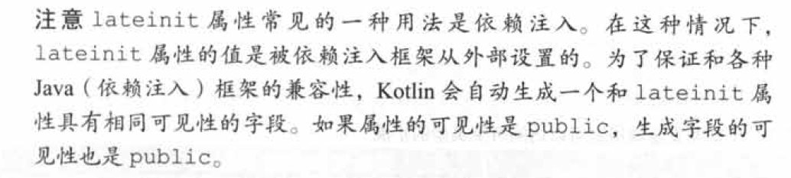
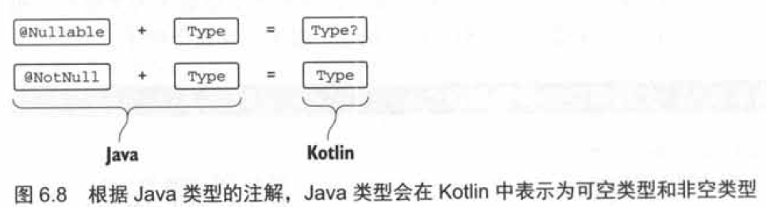
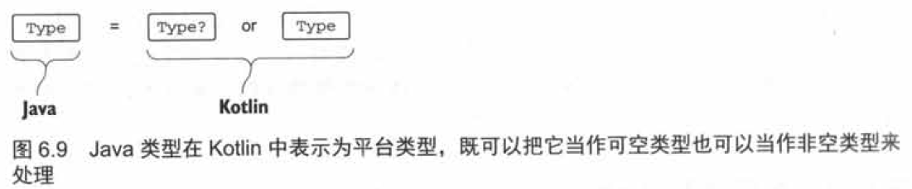
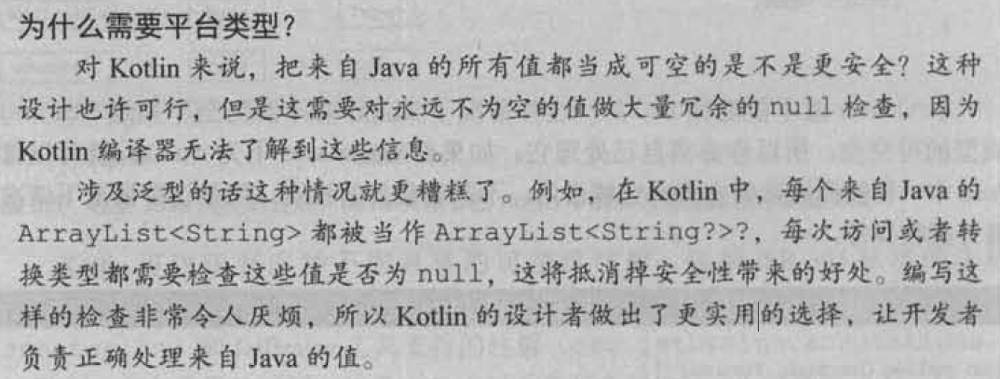
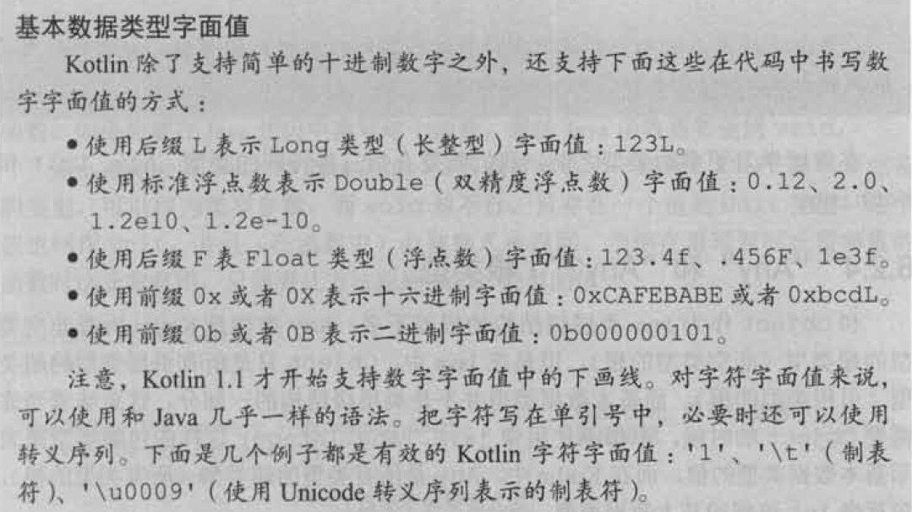
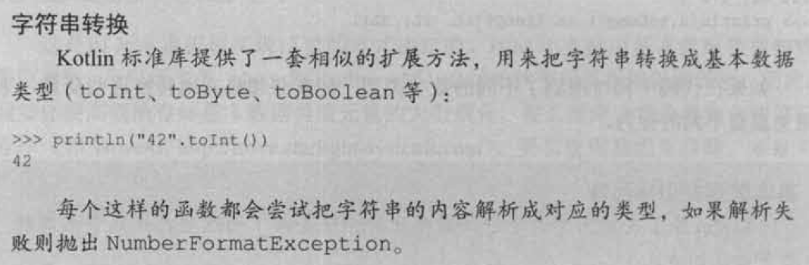

# kotlin的类型系统

## 可空性

#### 可空类型: ?

* 问号可以加在任何类型的后面来表示这个类型的变量可以存储null 引用: String?、Int?、MyCustomType?。
* 没有问号的类型表示这种类型的变量不能存储null引用，这说明所有常见类型默认都是非空的，除非显式地把它标记为可空。
* 一旦有可空类型的值，能对它进行的操作也会受到限制。
```
fun strLenSafe(s: String?) = s.length()
ERROR: only safe(?.) or non-null asserted(!!.) calls are allowed on a nullable receiver of type kotlin.String?
```
* 不能把它赋值给非空类型的变量。
```
val x: String? = null
var y: String = x
ERROR: Type mismatch: inferred type is String? but String was expected
```
* 不能把可空类型的值传给拥有非空类型参数的函数
```
strLen(x)
ERROR: Type mismatch: inferred type is String? but String was expected
```
* 正确写法，和null进行比较。
```
fun strLenSafe(s: String?): Int = 
    if (s != null) s.length else 0
```

#### 安全调用运算符: ?.

* 安全调用运算符?.
```
s?.toUpperCase() 相当于 if (s != null) s.toUpperCase() else null
```
* 安全调用处理可空属性
```
class Employee(val name: String, val manager: Employee?)
fun managerName(employee: Employee): String? = employee.manager?.name
```
* 链接多个安全调用
```
class Address(val streetAddress: String, val zipCode: Int,
    val city: String, val country: String)
class Company(val name: String, val address: Address?)
class Person(val name: String, val company: Company?)
fun Person.countryName() : String {
    val country = this.company?.address?.country
    return if (country != null) country else "Unknown"
}
val person = Person("Dmitry", null)
println(person.countryName()) // Unknown
```

#### Elvis运算符: ?:

* Elvis运算符接收两个运算数，如果第一个运算数不为null，运算结果就是第一个运算数；如果第一个运算数为null，运算结果就是第二个运算数。
```
fun foo(s: String?) {
    val t: String = s ?: ""
}
```
* Elvis运算符经常和安全调用运算符一起使用，用一个值代替对null对象调用方法时返回的null。
```
fun strLenSafe(s: String?): Int = s?.length ?: 0
```
* 在Kotilin中有一种场景下Elvis运算符会特别顺手，像return和throw这样的操作其实是表达式，因此可以把它们写在Elvis运算符的右边。这种情况下，如果Elvis运算符左边的值为null，函数就会立即返回一个值或者抛出一个异常。
```
class Address(val streetAddress: String, val zipCode: Int, val city: String, val country: String)
class Company(val name: String, val address: Address?)
class Person(val name: String, val company: Company?)
fun printShippingLabel(person: Person) {
    val address = person.company?.address ?: throw IllegalArgumentException("No address")
    with (address) {
        println(streetAddress)
        println("$zipCode $city, $country")
    }
}
```

#### 安全转换: as?

* as?运算符尝试把值转换成指定的类型， 如果值不是合适的类型就返回null。
```
class Person(val firstName: String, val lastName: String) {
    override fun equals(o: Any?): Boolean {
        val otherPerson = o as? Person ?: return false
        return otherPerson.firstName == firstName &&
            otherPerson.lastName == lastName
    }
    override fun hashCode(): Int =
        firstName.hashCode() * 37 + lastName.hashCode()
}
```

#### 非空断言: !!

* 非空断言是Kotlin提供给你的最简单直率的处理可空类型值的工具。它使用双感叹号表示，可以把任何值转换成非空类型。如果对null值做非空断言，则会抛出异常。
```
fun ignoreNulls(s: String?) {
    val sNotNull: String = s!!
    println(sNotNull.length)
}
ignoreNulls(null)
Exception in thread "main" kotlin.KotlinNullPointerException at < .. . >.ignoreNulls(07_NotnullAssertions.kt:2)
```

#### let函数

```
// 在kotlin中下面函数只接收一个非空参数
fun sendEmailTo(email: String) { /* ... */ }
// 不能把可空类型的值传给这个函数
// 编译器ERROR: Type mismatch: inferred type is String? but String was expected
val email: String? = ...
sendEmailTo(email)
// 必须显示地检查这个值不为null: 
if (email != null) sendEmailTo(email)
```
* let函数就是把一个调用它的对象变成lambda表达式的参数。如果结合安全调用语法，它能有效地把调用let函数的可空对象，转变成非空类型。
```
email?.let { email->sendEmailTo(email) }
email?.let { sendEmailTo(it) }
```
* 如果有一些很长的表达式结果不为null，而你又要使用这些结果时，let表示法特别方便。
```
val person : Person? = getTheBestPersoninTheWorld()
if (person != null) sendEmailTo(person.email)
// 使用let函数
getTheBestPersoninTheWorld()?.let { sendEmailTo(it.email) }
```

#### 延迟初始化的属性

* Kotlin通常要求你在构造方法中初始化所有属性，如果某个属性是非空类型，你就必须提供非空的初始化值。否则， 你就必须使用可空类型。如果你这样做，该属性的每一次访问都需要null检查或者!!运算符。
```
// 使用非空断言访问可空属性
class MyService {
    fun performAction(): String = "foo"
}
class MyTest {
    private var myService: MyService? = null
    @Before fun setUp() {
        myService = MyService()
    }
    @Test fun testAction() {
        Assert.assertEquals("foo", myService!!.performAction()) // 必须注意可空性: 要么用!!，要么用?.
    }
}
```
* 可以使用延迟初始化: lateinit修饰符。
```
class MyService {
    fun performAction(): String = "foo"
}
class MyTest {
    private lateinit var myService: MyService // 声明一个不需要初始化器的非空类型的属性
    @Before fun setUp() {
        myService = MyService()
    }
    @Test fun testAction() {
        Assert.assertEquals("foo", myService.performAction()) // 不需要null检查直接访问属性
    }
}
```
* 注意: 延迟初始化的属性都是var，因为需要在构造方法外修改它的值，而val属性会被编译成必须在构造方法中初始化的final字段。尽管这个属性是非空类型，但是你不需要在构造方法中初始化它。如果在属性被初始化之前就访问了它，会得到这个异常"lateinit property myService has not been initialized"(lateinit的属性myService没有被初始化)。


#### 可空类性的扩展

* 为可空类型定义扩展函数是一种更强大的处理null值的方式。可以允许接收者为null的(扩展函数)调用，并在该函数中处理null，而不是在确保变量不为null之后再调用它的方法。只有扩展函数才能做到这一点，普通成员方法的调用是通过对象实例来分发的，因此实例为null时(成员方法)永远不能被执行。
```
fun String?.isNullOrBlank() : Boolean = 
    this == null || this. isBlank()
fun verifyUserInput(input: String?) {
    if (input.isNullOrBlank()) { // 这里不需要安全调用
        println("Please fill in the required fields")
    }
}
verifyUserinput("")
verifyUserinput(null)
```
* 当你为一个可空类型(以？结尾)定义扩展函数时，这意味着你可以对可空的值调用这个函数；并且函数体中的this可能为null，所以你必须显式地检查。在Java中，this永远是非空的，因为它引用的是当前你所在这个类的实例。而在Kotlin中，这并不永远成立: 在可空类型的扩展函数中， this可以为null。
* 如果你在一个可空类型直接上调用let函数，而没有使用安全调用运算符，lambda的实参将会是可空的。
```
val person: Person? = ...
person.let { sendEmailTo(it) } // 没有安全调用，所以it是可空类型。
// ERROR: Type mismatch: inferred type is Person? but Person was expected
```

#### 类型参数的可空性

* Kotlin中所有泛型类和泛型函数的类型参数默认都是可空的。任何类型，包括可空类型在内，都可以替换类型参数。这种情况下，使用类型参数作为类型的声明都允许为null，尽管类型参数T并没有用问号结尾。
```
// 处理可空的类型参数
fun <T> printHashCode(t: T) {
    println(t?.hashCode()) // t可能为null，所以必须使用安全调用
}
printHashCode(null) // "T"被推导成"Any?"
```
* 要使类型参数非空，必须要为它指定一个非空的上界，那样泛型会拒绝可空值作为实参。
```
fun <T: Any> printHashCode(t: T) { // "T"就不是可空的
    println(t.hashCode())
}
printHashCode(null) // Error: Type parameter bound for T is not satisfied
```

#### 可空性和java

* java中的@Nullable String被kotlin当作String?，而@NotNull String就是String。

* 平台类型本质上就是Kotlin不知道可空性信息的类型。既可以把它当作可空类型处理，也可以当作非空类型处理。

```
/* java */
public class Person {
    private final String name;
    public Person(String name) {
        this.name = name;
    }
    public String getName() {
        return name;
    }
}
/* kotlin */
// 不使用null检查访问java类
fun yellAt(person: Person} {
    println(person.name.toUpperCase() + "!!!")
}
yellAt(Person(null)) // java.lang.IllegalArgumentException: Parameter specified as non-null
is null: method toUpperCase, parameter $receiver
// 使用null检查访问java类
fun yellAt(person: Person} {
    println((person.name ?: "Anyone").toUpperCase() + "!!!")
}
```
* 事实上，对于公有的Kotlin函数，编译器会生成对每个非空类型的参数(和接收者)的检查，所以，使用不正确的参数的调用尝试都会立即被报告为异常。
* 使用Java API时要特别小心。大部分的库都没有(可空性)注解，所以可以把所有类型都解释为非空，但那样会导致错误。为了避免错误，你应该阅读要用到的Java方法的文档(必要时还要查看它的实现)， 搞清楚它们什么时候会返回null，并给那些方法加上检查。

* 如前所述，你可以用你喜欢的方式来解释平台类型，既可以是可空的也可以是非空的，所以下面两种声明都是有效的。这种情况下，和调用方法一样，你需要确保正确地理解了可空性。如果你试图用来自Java的null值给一个非空的Katlin变量赋值，在赋值的瞬间你就会得到异常。
```
val s: String? = person.name
val s1: String = person.name
```
* 继承: 当在Katlin中重写Java的方法时，可以选择把参数和返回类型定义成可空的，也可以选择把它们定义成非空的。
```
/* java */
interface StringProcessor {
    void process(String value);
}
/* kotlin */
class StringPrinter: StringProcessor {
    override fun process(value: String) {
        println(value)
    }
}
class NullStringPrinter: StringProcessor {
    override fun process(value: String?) {
        value?.let { println(it) }
    }
}
```
* 注意，在实现Java类或者接口的方法时一定要搞清楚它的可空性。因为方法的实现可以在非Kotlin的代码中被调用，Kotlin编译器会为你声明的每一个非空的参数生成非空断言。如果Java代码传给这个方法一个null值，断言将会触发，你会得到一个异常，即便你从没有在你的实现中访问过这个参数的值。

## 基本数据类型和其它基本类型

#### 基本数据类型

* java区分基本数据类型和引用类型，kotlin并不区分基本数据类型和包装类型，永远是同一个类型。
```
val i: Int = 1
val list: List<Int> = listOf(1, 2, 3)
```
* 在运行时，数字类型会尽可能地使用最高效的方式来表示。大多数情况下一一对于变量、属性、参数和返回类型一一Kotlin的Int类型会被编译成Java基本数据类型int。唯一不可行的例外是泛型类，比如集合。用作泛型类型参数的基本数据类型会被编译成对应的Java包装类型。例如，Int类型被用作集合类的类型参数时，集合类将会保存对应包装类型java.lang.Integer的实例。
* 对应到java基本数据类型如下:
```
整数类型--Byte、Short、Int、Long
浮点数类型--Float、Double
字符类型--Char
布尔类型--Boolean
```
* 像Int这样的Kotlin类型在底层可以轻易地编译成对应的Java基本数据类型，因为两种类型都不能存储null引用。反过来也差不多: 当你在Kotlin中使用Java声明时，Java基本数据类型会变成非空类型(而不是平台类型)，因为它们不能持有null值。

#### 可空的基本数据类型

* Kotlin中的可空类型不能用Java的基本数据类型表示，因为null只能被存储在Java的引用类型的变量中。这意味着任何时候只要使用了基本数据类型的可空版本，它就会编译成对应的包装类型。


#### 数字转换

* Kotlin和Java之间一条重要的区别就是处理数字转换的方式。Kotlin不会自动地把数字从一种类型转换成另外一种，即便是转换成范围更大的类型。
```
val i = 1
val l: Long = i // 错误: 类型不匹配
val l: Long = i.toLong()
```
* 每一种基本数据类型(Boolean除外)都定义有转换函数: toByte()、toShort()、toChar()等。这些函数支持双向转换: 既可以把小范围的类型括展到大范围，比如Int.toLong()，也可以把大范围的类型截取到小范围，比如Long.toInt()。
* Kotlin要求转换必须是显式的，尤其是在比较装箱值的时候。比较两个装箱值的equals方法不仅会检查它们存储的值，还要比较装箱类型。所以，在Java中new Integer(42).equals(new Long(42))会返回false。

* 当你书写数字字面值的时候，一般不需要使用转换函数。一种可能性是用这种特殊的语法来显式地标记常量的类型，比如42L或者42.0f。而且即使你没有用这种语法，当你使用数字字面值去初始化一个类型己知的变量时，又或是把字面值作为实参传给函数时，必要的转换会自动地发生。此外，算术运算符也被重载了，它们可以接收所有适当的数字类型。
```
fun foo(l: Long) = println(l)
val b: Byte = 1 // 常量有正确的类型
val l = b + 1L // +可以进行字节类型和长整型参数的计算
foo(42) // 编译器认为42是一个长整型
```
* Kotlin算术运算符关于数值范围溢出的行为和Java完全一致: Kotlin并没有引入由溢出检查带来的额外开销。
